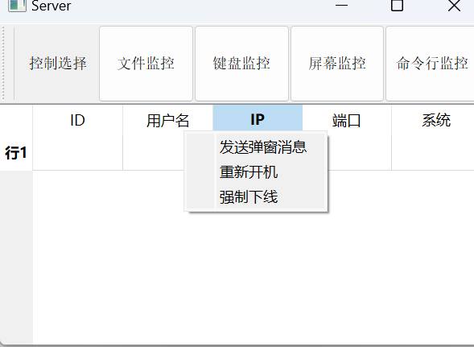
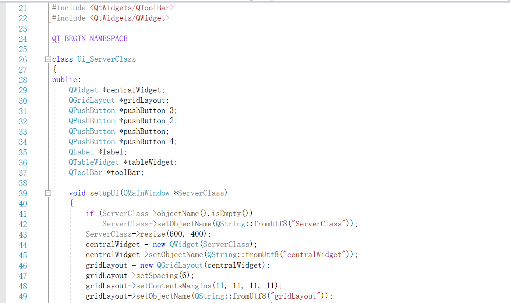
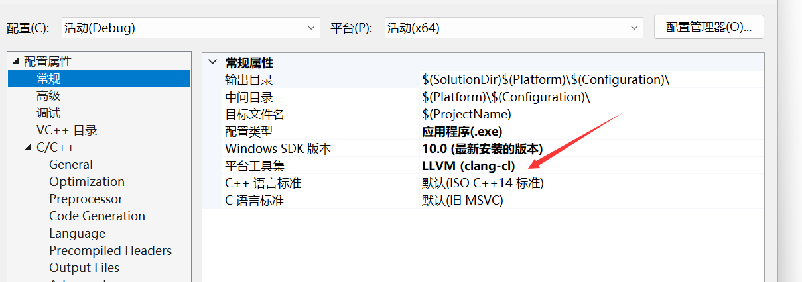
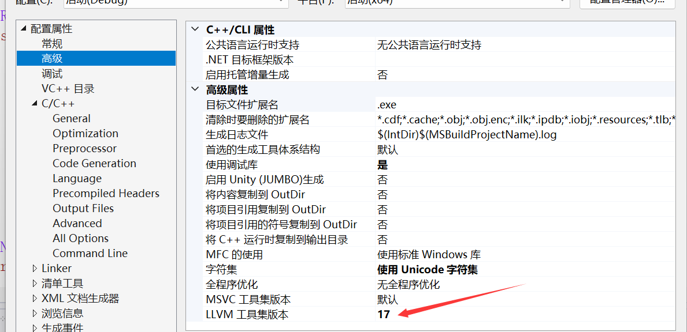
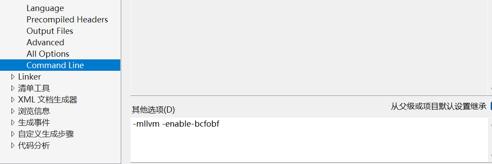
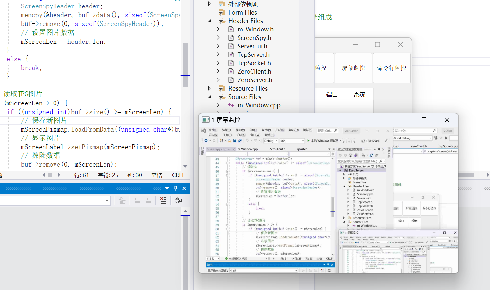
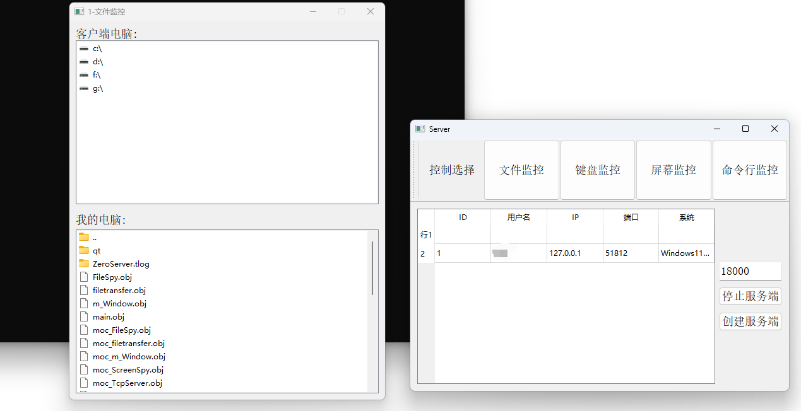

# 从零开始做一个远控

想做病毒分析，但是无奈好像连远控开发都不太会，所以开一个专题，记录下远控开发的过程

主要参考文章： [从零开始做远控 簡介篇 做一个属于你自己的远控_zeronet qt-CSDN博客](https://blog.csdn.net/sumkee911/article/details/53709689) 

这是16年的项目，有一些是无法正常直接编译的，我只参考这位大佬文章的内容，具体他发布的不在文章的源码我并未参照

## 第一节：用QT搭一个初始界面

有点拙劣，先随便看看


用UI搓的


右键可以弹出菜单：




## 第二节：搭建服务端网络通讯

要先添加一个Network的模块才可以是用网络库


因为想要移植UI，所以特地研究了一下如何移植别人的项目的UI文件到自己


**移植Qt Ui文件**

我在写QT项目的时候，想拿之前一个项目的UI文件直接使用，但是当我直接把其他项目的UI文件导入我的项目的时候，发现并不能直接使用


求助ChatGPT，发现QT已经为我们想到了这一切

在QT的bin目录下，有一个叫uic.exe的应用程序，这个负责将ui文件转为头文件.h，直接导入这个头文件，我们就可以使用原来的ui界面了


头文件长这样：

其实就是以代码的形式展现




其中：

```c++
namespace Ui {
    class ServerClass: public Ui_ServerClass {};
} // namespace Ui
```

解释一下就是：

用`Ui::ServerClass`代替`Ui_ServerClass `


然后可以自己新建一个头文件：

```c++
#include "ZeroServer_ui.h"
#include <QMainWindow>
#include <QMenu>
#include <QMessageBox>
#pragma execution_character_set("utf-8")
class ServerWindow : public QMainWindow {
    Q_OBJECT

public:
    explicit ServerWindow(QWidget* parent = nullptr)
        : QMainWindow(parent) {
        ui.setupUi(this); // 初始化界面
        Initialize_Interface();
    }

private:
    Ui::ServerClass ui; // 包含由 .ui 文件生成的 UI 类


private:
    void Initialize_Interface(); //初始化界面
    void Set_Right_click_options();//给表单结构的行设置右键选项

private slots:
    void showContextMenu(const QPoint& pos);
};
```

例如这样，加了我之前项目的一些函数，具体实现直接复制过来就行


完美运行


**配合PacketSender的效果展示：**


**代码分析**

`ZeroServer`含有两个主要成员：

```C++
TcpServer* mServer;         // Tcp服务端
QHash<int, ZeroClient*> mClients;  // 用ID来索引相应的客户
```


先说说`mServer`服务端：

这里初始化了一个TcpServer实例


而这个`TcpServer`实例其实是来自QT的类`QTcpServer`，然后`TcpServer`这个类会去对 `newConnection`这个信号进行转发，这样`ZeroServer`就可以对新连接进行处理


同理，在客户端`mClients`这里

调用 `login`进行添加


溯源发现是当有新连接的时候，`ZeroClient`会发一个login的信号


总之，QT的信号机制就是要一直溯源回去查看，这存在于类包含类的情况


## 第三节：受控程序的网络搭建：

还是像上一节服务端一样，建一个TcpSocket类和ZeroClient类

TcpSocket的接口主要有：连接，断开，发送，接受这几个功能 


ZeroClient类 

不断死循环，接收从服务端传过来的命令，比如：屏幕监控，键盘监控等等 


和原版的代码相比，我自己优化了对于系统的判断，毕竟微软官方文档说了`GetVersionExA`已经废弃

改成了这样：

```c++
std::string ZeroClient::getSystemModel()
{
    std::string version = "Unknown";

    // 获取 RtlGetVersion 函数指针
    HMODULE hNtdll = GetModuleHandle(L"ntdll.dll");
    RtlGetVersionPtr RtlGetVersion = (RtlGetVersionPtr)GetProcAddress(hNtdll, "RtlGetVersion");

    if (RtlGetVersion) {
        // 获取操作系统版本信息
        RTL_OSVERSIONINFOEXW osvi;
        ZeroMemory(&osvi, sizeof(osvi));
        osvi.dwOSVersionInfoSize = sizeof(osvi);

        NTSTATUS status = RtlGetVersion(&osvi);
        if (status == 0) { // 状态成功
            // 检查 Windows 11
            if (osvi.dwMajorVersion == 10 && osvi.dwMinorVersion == 0 && osvi.dwBuildNumber >= 22000) {
                version = "Windows11OrGreater";
   
            }
            // 检查 Windows 10
            else if (osvi.dwMajorVersion == 10 && osvi.dwMinorVersion == 0) {
                version = "Windows10OrGreater";
                
            }
            // 检查 Windows 8.1
            else if (osvi.dwMajorVersion == 6 && osvi.dwMinorVersion == 3) {
                version = "Windows8Point1OrGreater";
               
            }
            // 检查 Windows 8
            else if (osvi.dwMajorVersion == 6 && osvi.dwMinorVersion == 2) {
                version = "Windows8OrGreater";
              
            }
            // 检查 Windows 7
            else if (osvi.dwMajorVersion == 6 && osvi.dwMinorVersion == 1) {
                version = "Windows7OrGreater";
               
            }
            // 检查 Windows Vista
            else if (osvi.dwMajorVersion == 6 && osvi.dwMinorVersion == 0) {
                version = "VistaOrGreater";
               
            }
            // 检查 Windows XP
            else if (osvi.dwMajorVersion == 5 && osvi.dwMinorVersion == 1) {
                version = "XPOrGreater";
                
            }
        }
    }

    return version;

}
```


另外，如果受控主机是GBK编码，用户名可能会出错，所以要进行一个GBK转UTF-8的转换

```C++
std::string ZeroClient::getSystemModel()
{
    std::string version = "Unknown";

    // 获取 RtlGetVersion 函数指针
    HMODULE hNtdll = GetModuleHandle(L"ntdll.dll");
    RtlGetVersionPtr RtlGetVersion = (RtlGetVersionPtr)GetProcAddress(hNtdll, "RtlGetVersion");

    if (RtlGetVersion) {
        // 获取操作系统版本信息
        RTL_OSVERSIONINFOEXW osvi;
        ZeroMemory(&osvi, sizeof(osvi));
        osvi.dwOSVersionInfoSize = sizeof(osvi);

        NTSTATUS status = RtlGetVersion(&osvi);
        if (status == 0) { // 状态成功
            // 检查 Windows 11
            if (osvi.dwMajorVersion == 10 && osvi.dwMinorVersion == 0 && osvi.dwBuildNumber >= 22000) {
                version = "Windows11OrGreater";
   
            }
            // 检查 Windows 10
            else if (osvi.dwMajorVersion == 10 && osvi.dwMinorVersion == 0) {
                version = "Windows10OrGreater";
                
            }
            // 检查 Windows 8.1
            else if (osvi.dwMajorVersion == 6 && osvi.dwMinorVersion == 3) {
                version = "Windows8Point1OrGreater";
               
            }
            // 检查 Windows 8
            else if (osvi.dwMajorVersion == 6 && osvi.dwMinorVersion == 2) {
                version = "Windows8OrGreater";
              
            }
            // 检查 Windows 7
            else if (osvi.dwMajorVersion == 6 && osvi.dwMinorVersion == 1) {
                version = "Windows7OrGreater";
               
            }
            // 检查 Windows Vista
            else if (osvi.dwMajorVersion == 6 && osvi.dwMinorVersion == 0) {
                version = "VistaOrGreater";
               
            }
            // 检查 Windows XP
            else if (osvi.dwMajorVersion == 5 && osvi.dwMinorVersion == 1) {
                version = "XPOrGreater";
                
            }
        }
    }

    return version;

}
```


效果展示：


## 第四节：服务端对客户端的基本控制

这一节主要实现了弹窗，重启，下线的操作

具体博客有的东西不说了，主要讲讲`lambda`表达式

我发现`lambda`表达式在qt这种信号`connect`的方式非常好用


例如发送信号的时候，要传递参数，但是有一些信号，例如 `QPushButton::clicked` 信号的参数是**固定的**，但是又想要传进去参数，就可以用`lambda`表达式


例如这个信号 `QTableWidget::customContextMenuRequested`，对应的函数参数只能是`const QPoint& pos`

但是我又想使用一个非全局变量变量，就可以这样写

```c++
connect(ui.tableWidget, &QTableWidget::customContextMenuRequested,this, [this,contextMenu](const QPoint& pos) {
     showContextMenu(pos, contextMenu);  //传递QPoint和捕获的contextMenu
});
```

然后`showContextMenu`是我们的逻辑，但是`lambda`表达式的参数是符合这个信号的参数要求的


另外就是今天配置了一下visual studio的ollvm代码混淆，我是参考这篇文章的 [构建含有ollvm功能的LLVM(clang-cl)供Microsoft Visual Studio 2022使用 - 哔哩哔哩](https://www.bilibili.com/opus/943544163969794072) 


VS项目属性要这样设置










总之自己的项目实测的话，没有加ollvm混淆，微信传文件会被杀，但是如果加了ollvm混淆，可以成功让被控主机弹窗，重启，当然前提是人家双击运行.....


## 第五节：屏幕监控

这一节，很淦，因为我按照文章上复现，发现我的图片是斜的？？

后来才发现，原来bmp这里的iWidth，和iHeight必须要4的倍数，否则图片大小会有问题

 [BMP24位图因为字节不对齐而显示倾斜的问题_bmp显示在显示器上是斜体的有斜杠是什么原因-CSDN博客](https://blog.csdn.net/sara787/article/details/114962438) 

靠，原因找半天


所以代码要这样改


还有就是Vector的问题，文章源代码是有点问题的

我本以为vector是动态容器，所以不需要担心越界的问题，死活没看出来源代码有问题，但是一直报错实在崩溃，最后原因找到了，就是死在这，这里的bmpData是一个vector

data()方法会返回存储的缓冲区，但是这个可不是动态扩容的，这就是一个固定大小的缓冲区，写超了在Debug模式下是要报错的，vector在push的时候，会检查是否越界，此时才会决定是否动态扩容


效果演试：




## 第六节：文件监控

效果展示




