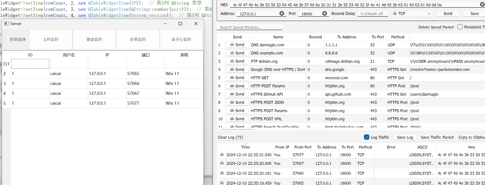

# 从零开始做一个远控

想做病毒分析，但是无奈好像连远控开发都不太会，所以开一个专题，记录下远控开发的过程


## 第一节：用QT搭一个初始界面

有点拙劣，先随便看看


用UI搓的


右键可以弹出菜单：


## 第二节：搭建服务端网络通讯

要先添加一个Network的模块才可以是用网络库


因为想要移植UI，所以特地研究了一下如何移植别人的项目的UI文件到自己


**移植Qt Ui文件**

我在写QT项目的时候，想拿之前一个项目的UI文件直接使用，但是当我直接把其他项目的UI文件导入我的项目的时候，发现并不能直接使用


求助ChatGPT，发现QT已经为我们想到了这一切

在QT的bin目录下，有一个叫uic.exe的应用程序，这个负责将ui文件转为头文件.h，直接导入这个头文件，我们就可以使用原来的ui界面了


头文件长这样：

其实就是以代码的形式展现


其中：

```c++
namespace Ui {
    class ServerClass: public Ui_ServerClass {};
} // namespace Ui
```

解释一下就是：

用`Ui::ServerClass`代替`Ui_ServerClass `


然后可以自己新建一个头文件：

```c++
#include "ZeroServer_ui.h"
#include <QMainWindow>
#include <QMenu>
#include <QMessageBox>
#pragma execution_character_set("utf-8")
class ServerWindow : public QMainWindow {
    Q_OBJECT

public:
    explicit ServerWindow(QWidget* parent = nullptr)
        : QMainWindow(parent) {
        ui.setupUi(this); // 初始化界面
        Initialize_Interface();
    }

private:
    Ui::ServerClass ui; // 包含由 .ui 文件生成的 UI 类


private:
    void Initialize_Interface(); //初始化界面
    void Set_Right_click_options();//给表单结构的行设置右键选项

private slots:
    void showContextMenu(const QPoint& pos);
};
```

例如这样，加了我之前项目的一些函数，具体实现直接复制过来就行


完美运行


**配合PacketSender的效果展示：**




**代码分析**

`ZeroServer`含有两个主要成员：

```C++
TcpServer* mServer;         // Tcp服务端
QHash<int, ZeroClient*> mClients;  // 用ID来索引相应的客户
```


先说说`mServer`服务端：

这里初始化了一个TcpServer实例


而这个`TcpServer`实例其实是来自QT的类`QTcpServer`，然后`TcpServer`这个类会去对 `newConnection`这个信号进行转发，这样`ZeroServer`就可以对新连接进行处理


同理，在客户端`mClients`这里

调用 `login`进行添加


溯源发现是当有新连接的时候，`ZeroClient`会发一个login的信号


总之，QT的信号机制就是要一直溯源回去查看，这存在于类包含类的情况

